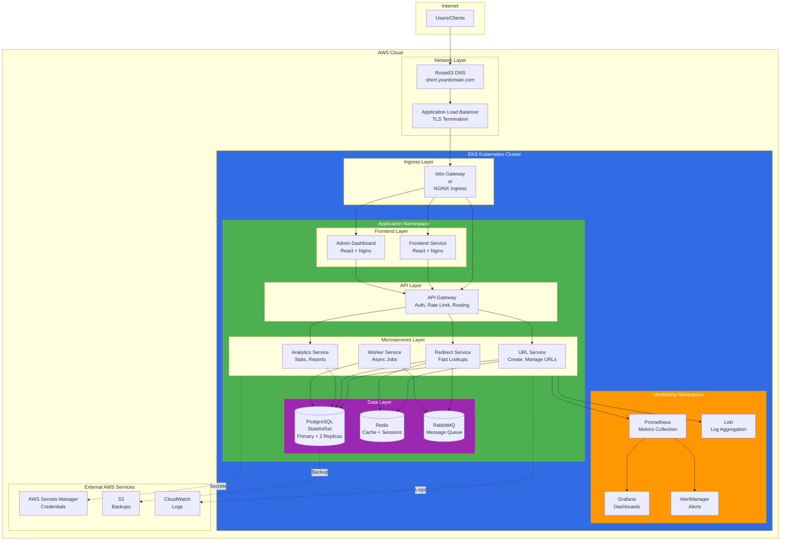
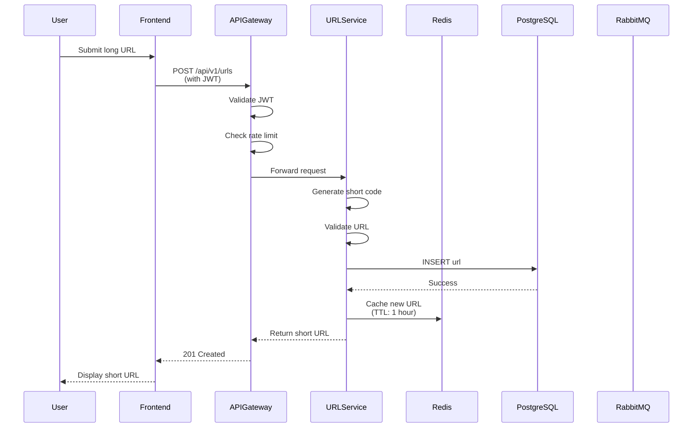
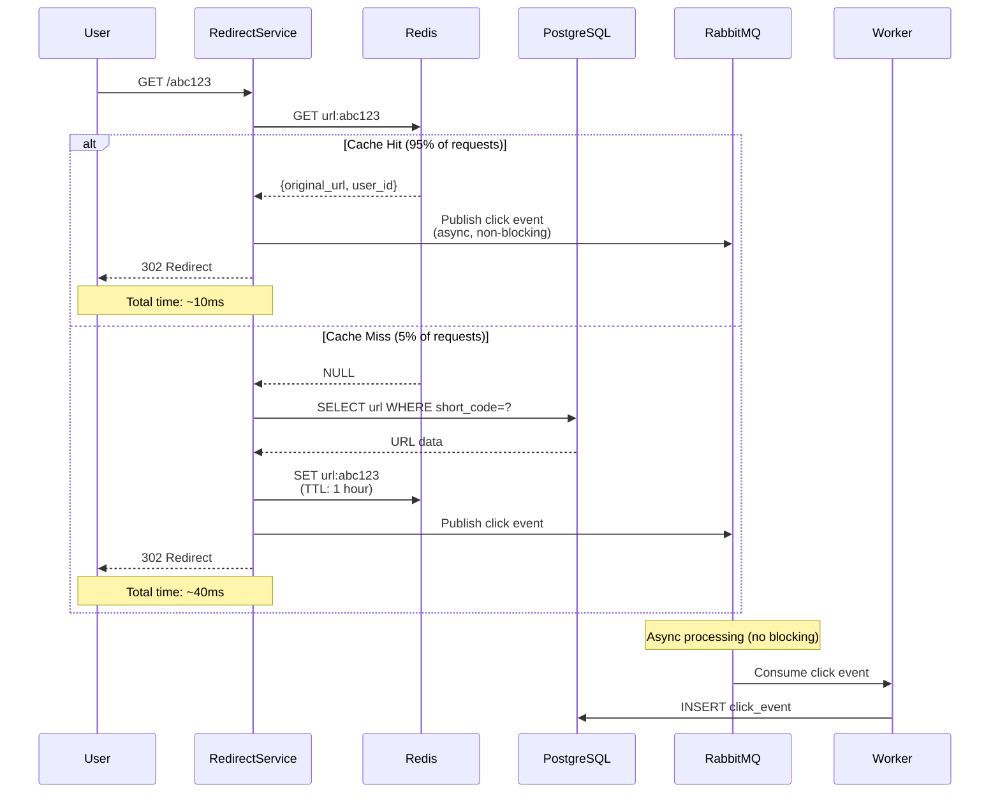
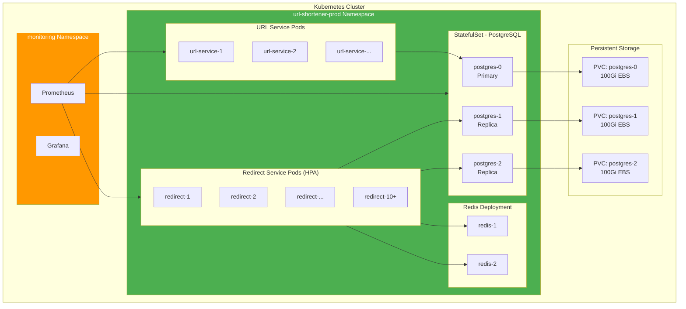
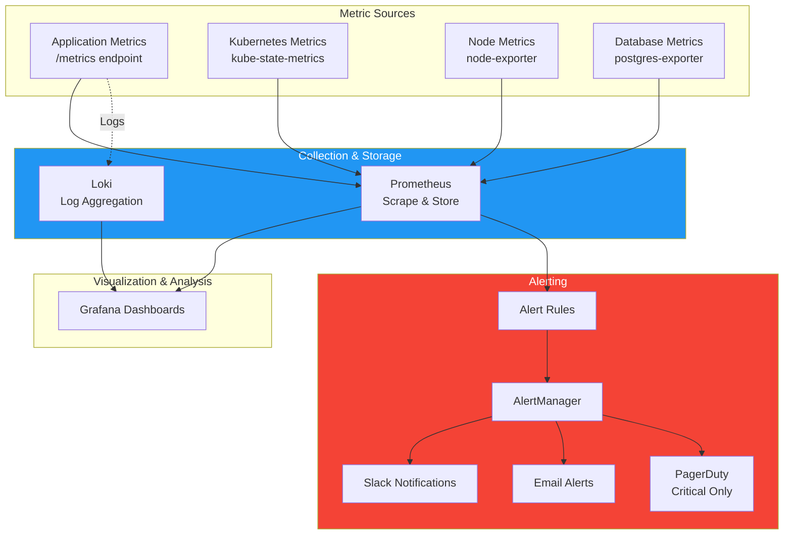
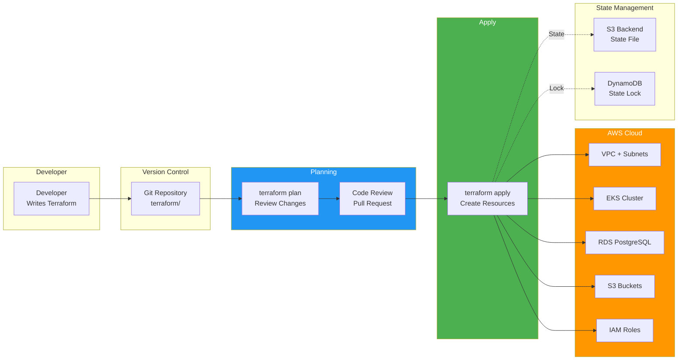
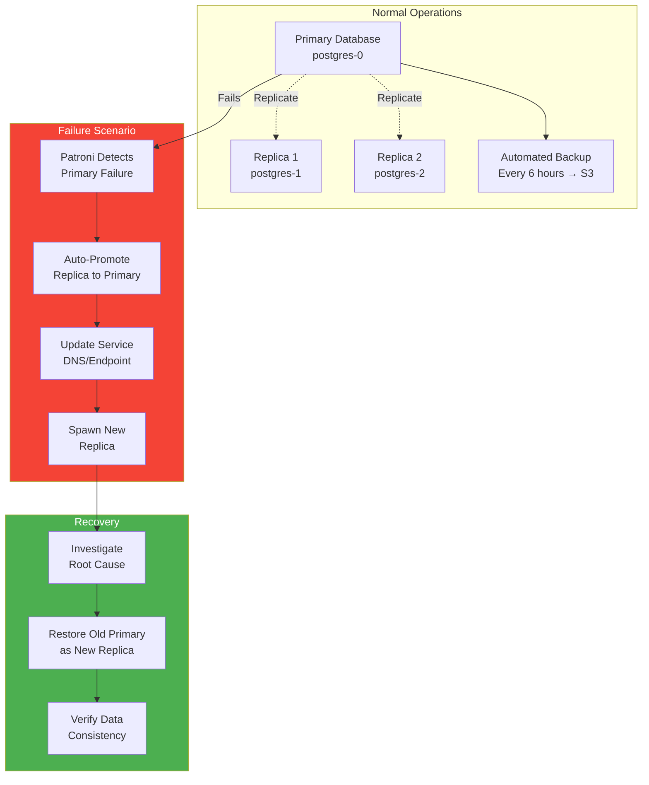

# URL Shortener - Architecture Diagrams

## High-Level System Architecture

## Request Flow - URL Creation

## Request Flow - URL Redirect (Hot Path)

## CI/CD Pipeline Flow

```mermaid
graph LR
    subgraph Developer
        Dev[Developer<br/>Pushes Code]
    end
    
    subgraph GitHub
        Repo[GitHub Repository]
        Actions[GitHub Actions]
    end
    
    subgraph Pipeline["CI/CD Pipeline"]
        Lint[Lint & Format<br/>Black, Flake8]
        Test[Unit Tests<br/>pytest]
        Security[Security Scan<br/>Trivy, Snyk]
        Build[Build Docker<br/>Images]
        Push[Push to Registry<br/>Docker Hub/ECR]
        UpdateGit[Update GitOps<br/>Repo]
    end
    
    subgraph GitOps
        ArgoCD[ArgoCD]
        K8s[Kubernetes<br/>Cluster]
    end
    
    subgraph Validation
        Smoke[Smoke Tests]
        Notify[Slack Notification]
    end
    
    Dev --> Repo
    Repo --> Actions
    Actions --> Lint
    Lint --> Test
    Test --> Security
    Security --> Build
    Build --> Push
    Push --> UpdateGit
    UpdateGit --> ArgoCD
    ArgoCD --> K8s
    K8s --> Smoke
    Smoke --> Notify
    
    style Pipeline fill:#4CAF50,color:#fff
    style GitOps fill:#2196F3,color:#fff
    style Validation fill:#FF9800,color:#fff
```

## Kubernetes Pod Architecture

## Monitoring & Alerting Flow

## Security Layers

```mermaid
graph TB
    subgraph External["External Threats"]
        Internet[Internet]
    end
    
    subgraph Layer1["Layer 1: Network Security"]
        ALB[AWS ALB<br/>DDoS Protection]
        WAF[AWS WAF<br/>SQL Injection, XSS]
        SG[Security Groups<br/>Port Restrictions]
    end
    
    subgraph Layer2["Layer 2: Ingress Security"]
        TLS[TLS 1.3<br/>Certificate]
        RateLimit[Rate Limiting<br/>Per IP/User]
    end
    
    subgraph Layer3["Layer 3: Application Security"]
        Auth[OAuth2<br/>Authentication]
        APIKey[API Key<br/>Validation]
        InputVal[Input Validation<br/>Sanitization]
    end
    
    subgraph Layer4["Layer 4: Service Mesh"]
        mTLS[Mutual TLS<br/>Between Services]
        NetPol[Network Policies<br/>Pod-to-Pod Rules]
    end
    
    subgraph Layer5["Layer 5: Container Security"]
        NonRoot[Non-Root User]
        ReadOnly[Read-Only FS]
        SecCtx[Security Context]
    end
    
    subgraph Layer6["Layer 6: Data Security"]
        Encrypt[Encryption at Rest<br/>EBS/RDS]
        Secrets[Secrets Manager<br/>No Plaintext]
        Backup[Encrypted Backups<br/>S3]
    end
    
    Internet --> ALB
    ALB --> WAF
    WAF --> SG
    SG --> TLS
    TLS --> RateLimit
    RateLimit --> Auth
    Auth --> APIKey
    APIKey --> InputVal
    InputVal --> mTLS
    mTLS --> NetPol
    NetPol --> NonRoot
    NonRoot --> ReadOnly
    ReadOnly --> SecCtx
    SecCtx --> Encrypt
    Encrypt --> Secrets
    Secrets --> Backup
    
    style Layer1 fill:#F44336,color:#fff
    style Layer2 fill:#FF5722,color:#fff
    style Layer3 fill:#FF9800,color:#fff
    style Layer4 fill:#FFC107,color:#fff
    style Layer5 fill:#8BC34A,color:#fff
    style Layer6 fill:#4CAF50,color:#fff
```

## Infrastructure as Code Flow

## Disaster Recovery Flow

---

## Legend

- **Solid lines**: Data flow / Direct communication
- **Dashed lines**: Async / Background operations
- **Colors**:
  - Blue: Infrastructure/Platform layer
  - Green: Application layer
  - Orange: Monitoring/Observability
  - Red: Security/Critical paths
  - Purple: Data layer

